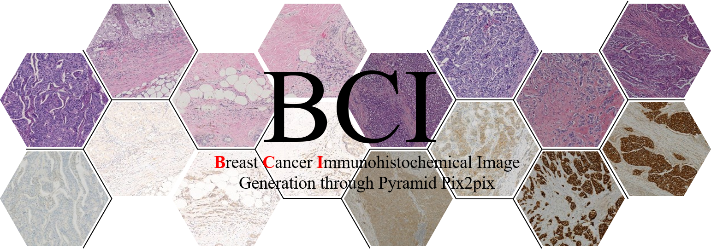

# BCI: Breast Cancer Immunohistochemical Image Generation through Pyramid Pix2pix 
[Project](https://bupt-ai-cz.github.io/BCI/) | [Arxiv](https://arxiv.org/pdf/2204.11425v1.pdf) | [](https://paperswithcode.com/sota/image-to-image-translation-on-bci?p=bci-breast-cancer-immunohistochemical-image)  [](https://paperswithcode.com/sota/image-to-image-translation-on-llvip?p=bci-breast-cancer-immunohistochemical-image) | [](https://twitter.com/intent/tweet?text=Codes%20and%20Data%20for%20Paper:%20"BCI:%20Breast%20Cancer%20Immunohistochemical%20Image%20Generation%20through%20Pyramid%20Pix2pix"%20&url=https://github.com/bupt-ai-cz/BCI)  

## News
- ⚡(2022-10-20): We have released the trained [model](https://github.com/bupt-ai-cz/BCI#trained-models) on BCI and LLVIP datasets.
- ⚡(2022-6-29): We host a competition for breast cancer immunohistochemistry image generation on [Grand Challenge](https://bci.grand-challenge.org/)！
- ⚡(2022-4-26): We have released BCI dataset and the code of PyramidPix2pix. You can download BCI dataset from the [homepage](https://bupt-ai-cz.github.io/BCI/) or [the-following-link](https://github.com/bupt-ai-cz/BCI/blob/main/download_dataset.md).

<!--
- ⚡(2022-4-25): The data is available [HERE!](https://bupt-ai-cz.github.io/BCI/)
-->
---



---
## Framework

## Setup
### 1)Envs
- Linux
- Python>=3.6
- CPU or NVIDIA GPU + CUDA CuDNN

Install python packages
```
git clone https://github.com/bupt-ai-cz/BCI
cd PyramidPix2pix
pip install -r requirements.txt
```
### 2)Prepare dataset
- Download BCI dataset from our homepage.
- Combine HE and IHC images.

  Project [pix2pix](https://github.com/junyanz/pytorch-CycleGAN-and-pix2pix) provides a python script to generate pix2pix training data in the form of pairs of images {A,B}, where A and B are two different depictions of the same underlying scene, these can be pairs {HE, IHC}. Then we can learn to translate A(HE images) to B(IHC images).

  Create folder `/path/to/data` with subfolders `A` and `B`. `A` and `B` should each have their own subfolders `train`, `val`, `test`, etc. In `/path/to/data/A/train`, put training images in style A. In `/path/to/data/B/train`, put the corresponding images in style B. Repeat same for other data splits (`val`, `test`, etc).

  Corresponding images in a pair {A,B} must be the same size and have the same filename, e.g., `/path/to/data/A/train/1.jpg` is considered to correspond to `/path/to/data/B/train/1.jpg`.

  Once the data is formatted this way, call:
  ```
  python datasets/combine_A_and_B.py --fold_A /path/to/data/A --fold_B /path/to/data/B --fold_AB /path/to/data
  ```

  This will combine each pair of images (A,B) into a single image file, ready for training.

- File structure
  ```
  PyramidPix2pix
    ├──datasets
         ├── BCI
               ├──train
               |    ├── 00000_train_1+.png
               |    ├── 00001_train_3+.png
               |    └── ...
               └──test
                    ├── 00000_test_1+.png
                    ├── 00001_test_2+.png
                    └── ...

  ```
## Train
Train at full resolution(1024*1024): 
```
python train.py --dataroot ./datasets/BCI --gpu_ids 0 --pattern L1_L2_L3_L4
```
By default, four scales of the pyramid are used for supervision. You can change the option `--pattern` to use less scales (e.g. `--pattern L1_L2_L3`).

Train at resolution 512*512 (less GPU memory required):
```
python train.py --dataroot ./datasets/BCI --preprocess crop --crop_size 512 --gpu_ids 0 --pattern L1_L2_L3_L4
```
Images are randomly cropped if trained at low resolution.
## Test
Test at full resolution(1024*1024): 
```
python test.py --dataroot ./datasets/BCI --gpu_ids 0
```
Test at resolution 512*512:
```
python test.py --dataroot ./datasets/BCI --preprocess crop --crop_size 512 --gpu_ids 0
```
See `PyramidPix2pix/options` for more train and test options.
<!-- The testing process requires less memory, we recommend testing at full resolution, regardless of the resolution used in the training process. -->
## Evaluate
Calculate average PSNR and SSIM.
```
python evaluate.py --result_path ./results/pyramidpix2pix
```
## Trained models
| dataset |     device      | backbone | PSNR | SSIM | model |
|---------|-----------------|-----------------------|------------|--------|-------|
|  BCI    | Tesla V100-32GB | resnet_9  | 21.16    | 0.477  |   [download](https://github.com/bupt-ai-cz/BCI/releases/download/v1.0/trained_on_BCI.zip)    |
| LLVIP   | Tesla V100-32GB | resnet_9  | 12.189   | 0.279  |   [download](https://github.com/bupt-ai-cz/BCI/releases/download/v1.0/trained_on_LLVIP.zip)    |

## Results

 | 
---|---
 | 


## Citation
```
@InProceedings{Liu_2022_CVPR,
    author    = {Liu, Shengjie and Zhu, Chuang and Xu, Feng and Jia, Xinyu and Shi, Zhongyue and Jin, Mulan},
    title     = {BCI: Breast Cancer Immunohistochemical Image Generation Through Pyramid Pix2pix},
    booktitle = {Proceedings of the IEEE/CVF Conference on Computer Vision and Pattern Recognition (CVPR) Workshops},
    month     = {June},
    year      = {2022},
    pages     = {1815-1824}
}
```
## Contact
Shengjie Liu (shengjie.Liu@bupt.edu.cn)

Chuang Zhu (czhu@bupt.edu.cn)

If you have any questions, you can contact us directly.
